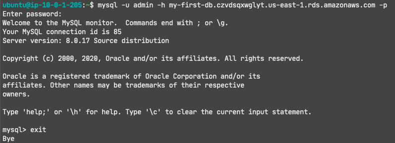
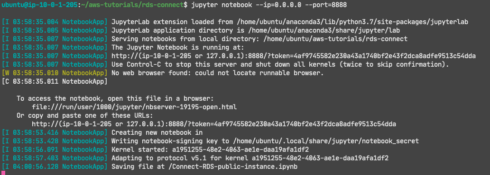
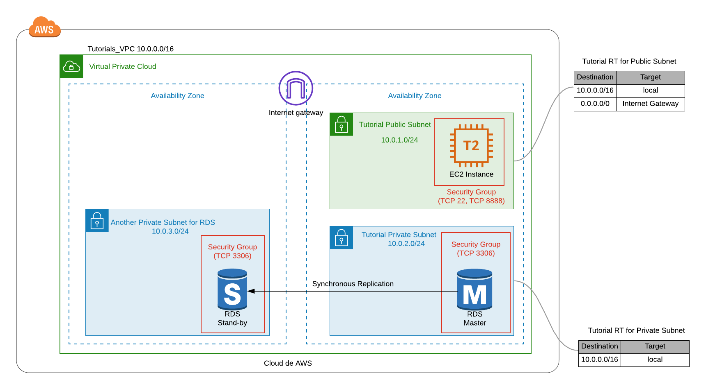

# Connect to RDS using Python

The RDS DB instance only needs to be available to the web server, and not to the public Internet, 
The web server should be hosted in the public subnet, so that it can reach the public Internet and the RDS DB instance 
needs to be hosted in a private subnet. The web server is able to connect to the DB instance because it is hosted within the same VPC, but the DB instance
 is not available to the public Internet, providing more security. 
 
## Goal
Create an RDS instance and upload data to the DB through an EC2 instance using Python, then query the data from a Jupiter Notebook running
on the EC2 instance. 

## Step-by-step
This guide assumes that a VPC, public and private subnet have already been created, refer to the documentation: [Pre-requisites](../README.md). 
We must have either two private subnets or two public subnets available to create a DB subnet group for a DB instance to use in a VPC. 


### Step-1: Create another subnet (which will be private) 
**AWS Console** -> **Services** -> **VPC** -> Subnet
* Create subnet
* Choose **Name Tag**: Another Private Subnet for RDS
* Choose the **VPC**: Tutorials_VPC
* Choose an **availability zone** (choose an Availability Zone that is different from the one that you chose for the first private subnet): us-east-1b
* Specify an **IPv4 CIDR** block for the subnet from the range of your VPC: 10.0.3.0/24
* Create

---

### Step-2: Create a DB subnet group
A DB subnet group is a collection of subnets that you create in a VPC and that you then designate for your DB instances. 
Subnets must reside in at least two different Availability Zones. If the primary DB instance of a Multi-AZ deployment fails, 
Amazon RDS can promote the corresponding standby and subsequently create a new standby using an IP address of the subnet in one 
of the other Availability Zones.

**AWS Console** -> **Services** -> **RDS** -> **Subnet groups** -> **Create DB Subnet group***

* **Name**: my-rds-tutorial-subnet-group
* **VPC**: Tutorials_VPC
* **Description**: A DB Subnet Group containing 2 private subnets
* **Availability Zones**: us-east-1a and us-east-1b
* **Subnets**: Select only the 2 private subnets
* Create

---
### Step-3: Create a Security Group for the RDS instance in the private subnet
We need to add a Inbound Rule in order to connect to MySQL in the private subnet from the public subnet.
**AWS Console** -> **Services** -> **EC2** --> **Security Groups** -> **Create security group**

* **Security group name**: rds-tutorial-sg
* **Description**: Allow MySQL traffic on port 3306 
* **VPC**: Tutorials_VPC
* Rules: 
                
    | Type         | Protocol | Port Range | Source                         |
    | :---:        |   :---:  | :---:      | :---                           |
    | MySQL/Aurora | TCP      | 3306       | 10.0.1.0/24 (our public subnet)|

* Create security group
---

### Step-4: Create and RDS Instance
In the AWS Management console click on **Create database** --> **Standard Create** -> Select Engine type **MySQL** - Templates **Free Tier** -> 

**Settings**:
* **DB instance identifier**: my-first-db
* **Master username**: admin
* **Master password**: <password>
* **Confirm password**: <password> 

Use the default values for **DB instance size**, **Storage** and **Availability & durability**

**Connectivity**
* **VPC**: Choose Tutorials_VPC (The VPC must have subnets in different Availability Zones)
* Open **Additional connectivity configuration**
* Select **my-rds-tutorial-subnet-group** (Step-2)
* **Publicly accessible**: No
* **VPC Security group**: Create new 
** **Security group name**: rds-tutorial-sg (Step-3)
** **Availability Zone**: No preference
** **Database port**: 3306

**Database authentication**
* Select **Password and IAM database authentication**


Open **Additional Configuration**:
* Initial database name: tutorial
* Backup
    - [] Enable automatic backups
    - [] Copy tags to snapshots
* Maintenance
    - [] Enable auto minor version upgrade
* Keep default settings for the other options
* Create database

---
### Step-5: Launch an EC2 instance in the public subnet
**AWS Console** -> **Services** -> **EC2**
* Launch instance
* Select Ubuntu Server 18.04 
* Select General purpose t2.micro (free tier elegible) -> Configure Instance Details
* **Network**: Tutorials_VPC
* **Subnet**: Tutorial Public Subnet
* **Auto-assign Public IP**: Enable -> Next: Add Storage -> Next: Add Tags
* Choose a **Name tag**: EC2 in public subnet -> Next: Configure Security Groups
* **Security Group Name**: my-sg-for-ec2-in-public-subnet
* **Description**: allow SSH connection IN and all traffic OUT 
* Rules:
    
    | Type      | Protocol | Port Range | Source    |
    | :---:     |   :---:  | :---:      | :---      |
    | SSH       | TCP      | 22         | 0.0.0.0/0 |
    | Custom TCP| TCP      | 8888       | 0.0.0.0/0 |

* Review and launch -> Launch (don't forget to download the key pair)

---
### Step-6: Installing the necessary software on the EC2 instance

#### Step-6.1: Connect to the EC2 instance

* SSH to the instance:
    
    ``ssh -i "your-keypair.pem" ubuntu@public-instance``

* Upgrade OS: 
    
    ```
    sudo apt-get update
    sudo apt-get upgrade
    ```

* Install packages: 
    ```
    sudo apt install mysql-client-core-5.7
    sudo apt install python3-pip
    ```

#### Step-6.2: Test the connection from the EC2 to the RDS instance
* `` mysql -u <user> -h <host> -p``
* Enter the password that was previously set
* Connection was successful 
 

 

#### Step-6.3: Clone this repository into the EC2

```
git clone git@github.com:dianapatrong/aws-tutorials.git
```

#### Step-6.4: Install the required python packages

``
cd aws-tutorials/rds-connect
pip3 install -r requirements.txt
``

#### Step-6.5: Environment variables
Export the following environment variables only for the sake of not storing the user and password in the repository:

```
export rds_user=<user>
export rds_password=<password>
```

---
### Step-7: Run the python script
The script **load_data.py** will connect to the RDS instance database, create the table **WORLD_CUP** if it does not exists 
and will load the data from the CSV file into the table in RDS

```
python3 load_data.py
```

---
### Step-8: Query data from jupiter notebook

* Install Jupyter Notebook
```
wget https://repo.anaconda.com/archive/Anaconda3-2019.03-Linux-x86_64.sh
bash Anaconda3-2019.03-Linux-x86_64.sh
export PATH=/home/ubuntu/anaconda3/bin:$PATH
```

* Create a config profile
```
jupyter notebook --generate-config
```

* Start Jupyter Notebook 
```
jupyter notebook --ip=0.0.0.0 --port=8888
```
 


* Go to ```http://{your-ec2-public-ip}:8888```
* Enter the token displayed when your Jupyter Notebook started


* Open the Notebook **Connect-RDS-public-instance.ipynb** and run it 


## Architecture




## Clean-up

* Terminate the EC2 instance
* Delete RDS Instance