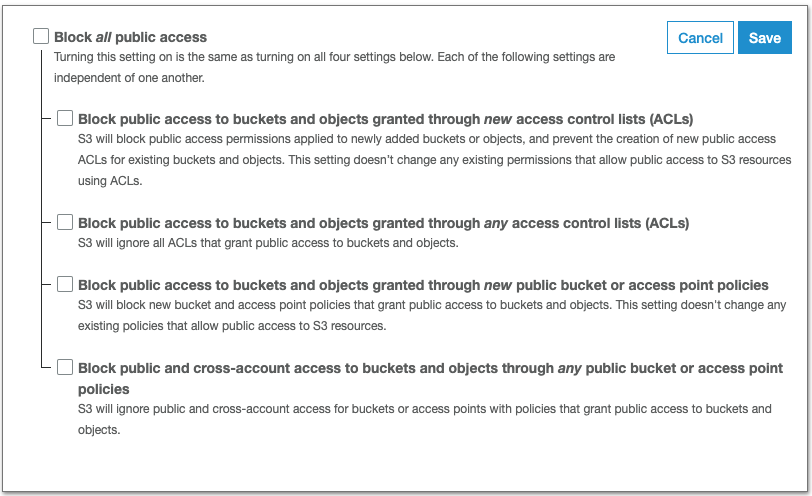

# Host a static website on Amazon s3


### Step-1 Create a bucket on the aws console
Go to S3 in the AWS management console and click **create bucket**, choose the region where you want to create it and accept
the default settings. 

### Step-2 Enable static website hosting for the bucket. 
Choose the bucket to use for your static website -> **Properties** -> **Static website hosting** 
-> **Use this bucket to host a website** 

Enter the name of the index document ``index.html`` and take note of the **Endpoint** (i.e. http://aws-tutorial-host-static-website.s3-website-us-east-1.amazonaws.com)

Click **Save**


### Step-3 Edit block public access settings
Amazon S3 blocks public access to the account/buckets by default, we have to click on the bucket to use for static website -> **Permissions**
-> **Edit** -> Clear **Block all public access** --> **Save**




### Step-4 Configure an index document
We need to create the ```index.html``` that we input in **Step-2**. The index document must exactly match de index document name that we configured.

Go to the AWS management console and choose the bucket to use for hosting the static website and upload the index file and the image you are going to display. On **Manage public permissions**
click on **Grant public read access to this object(s)**. 

### Step-5 Test the website endpoint
Go to the **Endpoint** given when you enabled **Static website hosting** on **Step-2**. If the browser displays your `index.html` page, the website was successfully deployed. 

